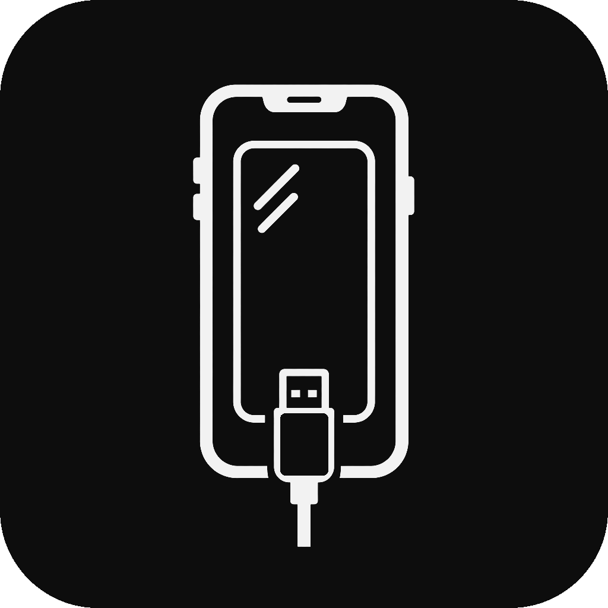

<p align="center">
  
</p>

<h1 align="center">iPhoneMirror</h1>

<p align="center">
  Low-latency iPhone screen and system-audio mirroring for Windows.<br>
  Direct USB capture and wireless AirPlay reception in one application.
</p>

<p align="center"><a href="README.md">简体中文</a> · <strong>English</strong></p>

<p align="center">
  <a href="https://github.com/RayrenSX/iPhoneMirror/releases"></a>
  <a href="https://github.com/RayrenSX/iPhoneMirror/actions/workflows/windows-build.yml"></a>
  <a href="LICENSE"></a>
  
</p>

> [!IMPORTANT]
> This is a public preview. The application is not commercially Authenticode
> signed, so Windows may show SmartScreen or unknown-publisher warnings. Apple
> Screen Capture is a private protocol and can change in future iOS versions.

## Download

Download `iPhoneMirror-*-win-x64.zip` from
[Releases](https://github.com/RayrenSX/iPhoneMirror/releases), extract it and
run `iPhoneMirror.exe`. The package is self-contained and does not require a
separate .NET Desktop Runtime. It also includes the standalone
`iPhoneMirror.Driver.exe` driver manager; no separate driver-tool download is
required.

The computer still needs either Apple Devices from Microsoft Store or the
desktop iTunes package containing Apple Mobile Device Support. Wireless
discovery uses the DNS-SD support built into Windows 10/11; no Bonjour service
or administrator access is required.

## Project description

iPhoneMirror is a local Windows 10/11 x64 iPhone/iPad mirroring tool. It keeps
wired USB capture and local-network AirPlay reception behind one session,
preview, audio, screenshot, detached-window, OBS and multi-device workflow,
without cloud relay.

The project has three explicit boundaries: the C++ core owns Apple's private
USB protocol, QuickTime/CoreMedia parsing, H.264 decoding, D3D11 rendering and
WASAPI audio; the WPF app owns device discovery, session control and UI; and an
isolated wireless host owns AirPlay protocol and decode, sending bounded media
frames over a named pipe. Driver installation, repair and removal belong to the
standalone `iPhoneMirror.Driver.exe`; the main app only reads wired-driver
state and never mutates system drivers inside the capture process.

## Features

| Area | Implementation |
|---|---|
| Wired capture | Direct USB with per-device Demo, experimental AirPlay, and Aisi-compatible modes |
| Wireless capture | Local-network AirPlay integrated with the main preview and every output feature |
| Video | CoreMedia/AVCC H.264 and low-latency Media Foundation decode |
| Rendering | Native D3D11/DirectComposition preview |
| Audio | USB 48 kHz PCM and AirPlay PCM with WASAPI playback, mute and volume |
| Devices | iPhone/iPad metadata, trust status, stable refresh and safe switching |
| Quality | Native/1080p/720p/540p local limits and 24/30/60/120 FPS limits |
| Preview | Main, detached, full-screen, rotation, aspect lock and device-aware corners |
| OBS | Stable-title dedicated window for Window Capture |
| Tools | Screenshot, force refresh, shortcuts, live logs, Chinese and English UI |
| Driver | Strict per-device check before wired capture; opens the standalone driver manager on failure |

Resolution and FPS options cap local presentation only; they do not reduce the
original USB stream quality.

USB devices default to **A Demo (recommended)**, which advertises
`Valeria=true` with the native `DisplaySize` and preserves complete phone framing, but locks status-bar date,
time, and battery to Apple's demo values. **B AirPlay (experimental)** uses
native dimensions and adaptive orientation so video apps can use external
playback, with possible cropping or incomplete framing. **C Aisi mode** fixes
the target at 1565×1565 for predictable negotiation at the cost of source
clarity. The exclamation button beside each mode shows its full tradeoffs, and
the selection applies only to the current USB device.

## Quick start

1. Extract the Release ZIP and run `iPhoneMirror.exe`.
2. Connect the iPhone or iPad over USB, unlock it and choose **Trust This Computer**.
3. Click **Driver manager** in the top bar and run one-click installation for the
   target device. The tool installs missing Apple USB support and the capture
   filter as needed.
4. Select the phone and click **Start Mirroring**. If the selected wired device
   has a missing or invalid driver, the app cancels that start attempt and opens
   the driver manager automatically.

Selecting another device first sends the QuickTime stop controls to the prior
session and restores its normal USB configuration. Closing the main window runs
the same cleanup path.

> [!WARNING]
> Do not use Zadig to replace the Apple parent driver with WinUSB/libusb.
> iPhoneMirror no longer bundles or installs capture drivers. Use the separate
> driver utility for any `libusb0` UpperFilter changes.

## Wired driver management

`iPhoneMirror.exe` only reads driver state. Installation, repair and removal are
performed by the standalone `iPhoneMirror.Driver.exe` in the same directory.
The **Driver manager** button in the top bar opens it at any time; if that exact
tool is already running, the existing window is activated.

When **Start Mirroring** is clicked for a wired device, the app verifies the
currently selected phone before creating a capture session:

- the Apple USB parent still uses `usbccgp`;
- the device has the `libusb0` UpperFilter;
- the `libusb0.sys` file and service are healthy; and
- `libusb0` can enumerate the exact device serial.

Any failure blocks that wired start attempt and opens the driver manager. After
repairing the driver and reconnecting the device when prompted, return to the
main app and click **Start Mirroring** again. UI logs are stored at
`%LOCALAPPDATA%\iPhoneMirror.Driver\Logs\driver-ui.log`; elevated operation logs
are stored under `%ProgramData%\iPhoneMirror.Driver`.

> [!NOTE]
> This automatic check applies only to wired USB devices. Wireless AirPlay
> sources neither require nor inspect `libusb0`, and never open the driver
> manager because of driver state.

## Wireless AirPlay

1. Connect the Windows computer and iPhone/iPad to the same private network.
2. Select the **iPhoneMirror AirPlay** source and optionally edit its receiver name.
3. Click the same **Start Mirroring** button used for USB sources.
4. Open Screen Mirroring in iOS Control Center and select `iPhoneMirror AirPlay`.
5. Allow the receiver on Private networks if Windows Firewall asks.

AirPlay uses the same session path as USB, including the main
preview, resolution/FPS limits, volume, screenshots, detached and full-screen
windows, simultaneous sessions and OBS.

During the AirPlay `SETUP` handshake, the receiver reads the sender's
`deviceID`, `model` (Apple ProductType such as `iPhone9,1`) and `osVersion`
from the binary plist. The values cross the versioned named-pipe IPC as a
`DeviceInfo` message and are shown in the selected-device panel. Known
ProductTypes are rendered as a human-readable model while retaining the raw
identifier in parentheses; unknown identifiers are shown unchanged.

## Third-party dependencies and licensing

| Dependency | Purpose | License/source |
|---|---|---|
| .NET 10, WPF, Windows SDK | UI, Windows APIs and publishing runtime | Microsoft official runtime |
| libusb 1.0.29 | Optional USB transport compatibility layer | LGPL-2.1-or-later, `third_party/libusb/` |
| libusb-win32 1.2.6.0 | `libusb0` filter driver used by the standalone manager | LGPL-3.0 and upstream terms, `src/DriverInstaller/Assets/` |
| AirPlayServer 1.1.0 | Wireless AirPlay, FairPlay, video and audio decode | GPL-3.0, LGPL-2.1-or-later and upstream terms, `third_party/airplay-server/` |
| FFmpeg 4.4.2 runtime | AirPlay video/audio decode dependency | LGPL-2.1-or-later, distributed with AirPlayServer |
| quicktime_video_hack fixtures | QuickTime protocol regression vectors | MIT, test fixtures only |

Apple Devices, Apple Mobile Device Support, iTunes and Windows system
components are external prerequisites and are not redistributed by this
project. See [`THIRD_PARTY_NOTICES.md`](THIRD_PARTY_NOTICES.md) and the
AirPlayServer `SOURCE.md` for copyright, source, version, hash and license
details.

## OBS

Open the detached preview for either USB or AirPlay and select its iPhoneMirror
window in OBS Window Capture. Windows Graphics Capture is recommended on
Windows 11. See [OBS_OUTPUT.md](docs/OBS_OUTPUT.md).

## Verified devices

| ProductType / iOS | Native frame | Measured result |
|---|---:|---|
| `iPhone18,3` / iOS 26.5.2 | 1206×2622 | ~58.6 FPS, typical decode 3–5 ms, 48 kHz stereo PCM |
| `iPhone13,1` / iOS 18.7.8 | 1082×2340 | ~58.9 FPS, typical decode 3–6 ms, 48 kHz stereo PCM |

These are tested combinations, not a guarantee for every iPhone or iOS build.

## Build from source

Requirements: Windows 10/11 x64, Visual Studio 2026 Build Tools with MSVC,
Windows SDK and CMake, plus the .NET 10 SDK with Windows Desktop support.

```powershell
git clone https://github.com/RayrenSX/iPhoneMirror.git
cd iPhoneMirror
./build.ps1 -Configuration Release
```

The script builds the C++20 core, runs protocol tests and publishes the
self-contained WPF application under `outputs/iPhoneMirror`, including:

```text
outputs/iPhoneMirror/iPhoneMirror.exe
outputs/iPhoneMirror/iPhoneMirror.Driver.exe
outputs/iPhoneMirror/iPhoneMirror.Core.dll
outputs/iPhoneMirror/Wireless/iPhoneMirror.WirelessHost.exe
```

## Architecture

```text
iPhone/iPad
  ├─ USB / QuickTime ─► H.264 / PCM decode ─┐
  └─ AirPlay ─► WirelessHost ─► I420 / PCM ─┤
                                             └─► native session
                                                  ├─► D3D11 previews
                                                  ├─► screenshot / OBS
                                                  └─► WASAPI audio
```

See [protocol](docs/PROTOCOL.md), [architecture](docs/ARCHITECTURE.md),
[D3D11 rendering](docs/D3D11_RENDERING.md),
[device corner profiles](docs/DEVICE_CORNER_PROFILES.md) and
[WASAPI audio](docs/WASAPI_AUDIO.md) documentation.

## Current limitations

- OBS uses Window Capture; there is no virtual camera yet.
- The app is not commercially code-signed.
- The external driver installation matrix needs broader testing.
- Apple does not publish Screen Capture as a stable third-party API.
- AirPlay compatibility is unofficial and can change with future iOS releases.
- The project does not provide iPhone touch or remote control.

## Contributing and security

Read [SUPPORT.md](SUPPORT.md) before opening an issue and
[CONTRIBUTING.md](CONTRIBUTING.md) before sending a pull request. Report
security issues through
[private vulnerability reporting](https://github.com/RayrenSX/iPhoneMirror/security/advisories/new).
Never publish a real UDID, pairing record or unredacted USB capture.

## License and acknowledgements

Original iPhoneMirror code is licensed under the
[GNU General Public License v3.0 only](LICENSE). Distribution of modified or
derivative versions must follow GPLv3 source-availability, notice and copyleft
requirements. Bundled third-party components remain under their own licenses;
see [THIRD_PARTY_NOTICES.md](THIRD_PARTY_NOTICES.md).

The wireless receiver is distributed as an independent GPLv3 process. Exact
source links, binary hashes and component licenses are included under
`Wireless/licenses` in every release package.

Protocol research references:

- [danielpaulus/quicktime_video_hack](https://github.com/danielpaulus/quicktime_video_hack)
- [chotgpt/quicktime_video_hack_windows](https://github.com/chotgpt/quicktime_video_hack_windows)

Apple, iPhone, iOS and QuickTime are trademarks of Apple Inc. This project is
not affiliated with, sponsored by or endorsed by Apple Inc.
