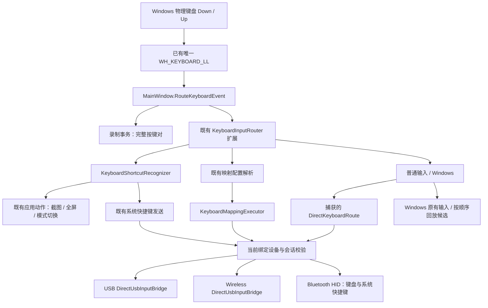

# Keyboard Input Router：审计、实现与验证

## 1. 修改前的实际输入链路与根因

审计范围：主 WPF 窗口、NativePreviewHost、NativePreviewWindow、Raw Input、WH_KEYBOARD_LL、WM_HOTKEY、映射录制/执行、USB/无线 DirectUsbInputBridge、BluetoothHidMouseService、DeviceControlSession 与设备绑定后的路由捕获。

- `MainWindow.KeyboardMapping.ProcessMappingHook` 先于其他路径处理物理事件；`KeyboardMappingKeyState`、`KeyboardMappingWindowsKey`、`KeyboardMappingHoldState` 分别保存映射、Win 键候选和触控释放状态。
- `MainWindow.WindowMessageHook` 根据 `WM_HOTKEY` 执行注册的快捷键；主窗口 `OnPreviewKeyDown/Up`、直通输入中的 `TryHandleConfiguredKey` 又有自己的快捷键判断；独立预览窗口另行截获 Boss/F11/Escape。
- 原 `KeyboardInputRouter.Route` 只协调 Mapping/Direct 模式及交接代次，并未裁决快捷键。
- `TryHandleConfiguredKey` 在映射模式直接返回 false；`ShouldRegisterDeviceHotkeys` 与 `SendConfiguredSystemShortcutAsync` 又要求 Direct 模式。因此同时打开映射时，设备快捷键被排除。
- Ctrl/Shift 等修饰键可能先由 Raw Input 发出，随后主键才被 WM_HOTKEY 或窗口快捷键分支消费；原 `_shortcutKeysDown`、`_ordinaryKeysDown`、映射状态各自掌握 Down/Up，不能作为一个组合统一消费。
- **没有发现第二套全局键盘 Hook。** 冲突来自同一物理事件的多条执行路径和多份归属状态，而不是两个 WH_KEYBOARD_LL 实例。
- 有线和无线共享 DirectUsbInputBridge 的协议发送实现，但由不同的 DeviceControlSession/桥实例及 generation 约束；蓝牙使用独立的 HID report 队列。现有 `CaptureDirectKeyboardRoute` / `CaptureTouchRoute` 已具备目标设备、会话代次和重连校验，本次保留。

## 2. 实现和文件

| 文件 | 类 / 方法 | 变化 |
|---|---|---|
| `src/App/Services/KeyboardInputRouter.cs` | `BeginHandoff` | 交接前统一释放/退休物理按键，保留旧模式代次保护 |
| `src/App/Services/KeyboardInputRouter.Events.cs` | `RouteEvent`, `ReleaseAllPressedKeys`, `RouteShortcutTrigger` | 每次物理按下固定 Windows/Candidate/Shortcut/Mapping/Direct 归属；重复、Up、失焦和旧会话统一收尾 |
| `src/App/Services/KeyboardShortcutRecognizer.cs` | `Configure`, `Match`, `IsCandidate` | 复用 KeyboardShortcut 配置，纯识别，不发送 HID 或触控 |
| `src/App/MainWindow.KeyboardRouting.cs` | `ProcessKeyboardHook`, `RouteKeyboardEvent`, `ConfigureKeyboardShortcuts` | 唯一生产键盘入口；连接既有动作、映射解析、直通会话和 Windows 回放；录制事务拥有其完整按键对 |
| `src/App/MainWindow.xaml.cs` | `KeyboardHookProcedure`, `HandleControlKeyboardInput`, `DispatchControlKeyboardInput`, `TryRegisterShortcutSetCore` | Hook 统一裁决；窗口/Raw 适配器不重复发送；RegisterHotKey 仅作为保存时占用探测；WM_HOTKEY 不再执行动作 |
| `src/App/MainWindow.KeyboardMapping.cs` | `ReconcileKeyboardHook`, `QueueMappedGesture`, `CancelMappedGesture` | 复用唯一 Hook；移除生产路径中的独立映射状态裁决；队列使用现有 generation/捕获目标并统一取消 |
| `src/App/MainWindow.KeyboardInputMode.cs`, `MainWindow.KeyboardFocus.cs`, `Services/KeyboardMappingFocusGuard.cs` | 模式交接及主/独立窗口焦点处理 | 保留旧后端释放、写入排空、物理旧键隔离；Up 不因失焦而被丢弃 |
| `src/App/MainWindow.Shortcuts.cs` | `SendRoutedKeyboardAsync`, `KeyboardSessionGate` | 同一会话中串行协调直通报告与系统快捷键；不同设备的发送互不阻塞 |
| `src/App/Services/KeyboardMappingExecutor.cs` | `ExecuteAsync` | 完整短按在 UI 队列启动之前结束时仍保留 down/up；过期代次不执行；同键生命周期按顺序完成 |
| `src/App/Windows/NativePreviewWindow.cs`, `Services/MultiDevicePreviewManager.cs` | 键盘窗口分支、按 HWND 切换全屏 | 删除独立键盘快捷键执行和旧注册状态回调，F11/Escape 由 Router 定位当前预览窗口 |
| `src/App.Runtime.Tests/KeyboardRouterTests.cs`, `KeyboardRouterDispatchTests.cs` | `--keyboard-router` | 新状态机和真实 Hook 回调/协议发送器集成验证 |
| 既有 KeyboardOwnership/KeyboardFocus/KeyboardTransport/ShortcutRegression 测试 | 相关测试 | 将旧注册/即时修饰键断言迁移到统一归属；保留多设备、写入阻塞、失败释放、外部占用检测 |

本次没有重做映射 UI。工作区中的映射向导等同步修改保留；后续按用户要求将双向剪贴板纳入统一路由审查，进展见第 8 节。

## 3. 最终输入架构



WPF、Native HWND 和 Raw Keyboard 消息只在 Hook 未安装时作为同一 Router 的适配入口；Hook 有效时不再次转发。Raw Mouse 保留原实现。普通 WPF 编辑、对话框和媒体控件仍接收 Router 留给 Windows 的输入。

## 4. 输入优先级与候选规则

1. 映射录制事务优先，完成或取消后仍处理其已持有键的 Up。
2. 主键首次 Down 时按**完整修饰键掩码精确匹配**现有配置。Ctrl+Shift+F1 不会匹配 Ctrl+F1；配置快捷键先于相同组合的内置本地动作。保留既有重复快捷键、单键映射冲突和外部 RegisterHotKey 占用检查。
3. 未匹配快捷键时，按现有物理扫描码/扩展位匹配映射；修饰键组合不误触发单独修饰键映射。
4. 无映射时沿用现有模式：Direct 向当前会话发送普通键盘输入；Mapping 模式中未映射的键留给 Windows。没有新增一个与现有映射设置并行的配置系统。

候选修饰键没有定时等待窗口：遇到非匹配主键或本键 Up 时立即确定回退；单独 Ctrl 不会被永久吞掉。普通 WASD 无候选延迟。按键识别遵循既有快捷键习惯：修饰键先于主键；主键已执行后再追加修饰键不会追溯改变它的归属。

全局快捷键在其他 Windows 程序中识别时，未接管手机输入的普通 Ctrl/Shift 等仍即时交给 Windows，避免影响 Ctrl+点击；仅需要防止手机端输入泄漏的上下文缓存快捷键前缀。左右 Ctrl/Shift/Alt/Win 分别记录物理状态；快捷键设置继续使用既有家族级 Ctrl/Shift/Alt 掩码，且继续不支持 Win 组合配置。单独 Win 映射和 Win 系统组合的回退经过同一 Router。

鼠标快捷键继续存在，其修饰键读取 Router 状态，不依赖可能缺少已缓存修饰键的 WPF Keyboard.Modifiers。

## 5. Down / Up 和异常生命周期

- 每次首次 Down 创建一个归属；自动重复不重新识别、不重启映射或 Toggle。
- Shortcut 先将所有尚未下发的候选和主键标记为已消费，再排队执行业务动作；Up 不进入映射或普通 HID。
- Mapping / Direct 保留同一次按下的释放回调；Direct 捕获具体 session，触控执行继续使用原有 CapturedTouchRoute 的设备、桥、generation 和坐标转换。
- 失焦、窗口关闭、设置变更和模式/设备切换通过 `ReleaseAllPressedKeys` 及现有交接流程取消触控、排空旧发送并释放旧后端。旧物理键保留退休状态到 Up，不能在新设备上重新成为 Down。
- 异步快捷键/映射执行前复核代次、设备和焦点。断开/重连后的旧回调不能获得新后端。发送互斥按 session 区分，A 的慢写入不会堵住 B。
- 失败的 Windows 候选回放按顺序插入前缀与当前事件；候选在 Up 时结束则回放完整 down/up，抑制原始 Up，避免原始事件越过被延迟的 Down。
- 保留现有 IPC 失败关闭管道机制；不向可能已损坏的半帧后追加任意字节。清理回调仍针对捕获会话尝试释放。

Router 状态只在 UI dispatcher 修改，工作线程仅检查现有不可变会话/代次保护。识别路径不读磁盘、不刷新 UI、不等待传输、不新增线程/全局 Hook/候选定时器。诊断事件在 Debug 下通过 `KeyboardInputRouter.TraceEnabled` 显式开启，默认关闭；模式交接/错误继续使用现有日志。

## 6. 验证方式与边界

可复现命令（仓库根目录）：

```powershell
dotnet build src/App.Runtime.Tests/IPhoneMirror.App.Runtime.Tests.csproj --no-restore -v minimal
dotnet run --no-build --no-restore --project src/App.Runtime.Tests/IPhoneMirror.App.Runtime.Tests.csproj -- --keyboard-router
dotnet run --no-build --no-restore --project src/App.Runtime.Tests/IPhoneMirror.App.Runtime.Tests.csproj -- --keyboard-ownership
dotnet run --no-build --no-restore --project src/App.Runtime.Tests/IPhoneMirror.App.Runtime.Tests.csproj -- --keyboard-focus
dotnet run --no-build --no-restore --project src/App.Runtime.Tests/IPhoneMirror.App.Runtime.Tests.csproj -- --shortcuts
dotnet run --no-build --no-restore --project src/App.Runtime.Tests/IPhoneMirror.App.Runtime.Tests.csproj -- --keyboard-mapping-regressions
```

详细本地输出保存在 `outputs/keyboard-router-validation/`。最终执行状态见该目录中的 `results.txt`。

| 实际执行项目 | 结果 / 证据 |
|---|---|
| Runtime 项目完整 build | 0 errors；1 个 NU1900 在线漏洞索引警告；`build.log` |
| `--keyboard-router` | 通过；100 次 Ctrl+S、20,000 WASD 对（最近一次约 63.9 ms）、USB/无线 Hook→协议包、真实截图处理入口、关闭时释放/取消旧动作；`keyboard-router.log` |
| `--keyboard-ownership` | 通过；双向交接、1,000 次快速切换、旧写入排空、重连代次、触控取消；`keyboard-ownership.log` |
| `--keyboard-focus` | 通过；USB/无线/蓝牙焦点、两台有线设备及有线/无线组合、独立窗口；`keyboard-focus.log` |
| `--shortcuts` | 通过；快捷键编辑/外部占用、键鼠快捷键、修饰键顺序、USB/无线按钮与 Globe、蓝牙 Consumer report、失败清理；`shortcuts.log` |
| `--keyboard-mapping-regressions` | 通过；帧写入中释放、取点后时长保留、粘贴帧尺寸；`keyboard-mapping-regressions.log` |
| `--keyboard-mapping-lifecycle` | 通过；真实主 HWND/独立预览壳、全屏、编辑/开关、多设备、方向、断连/重连、全局关闭；`keyboard-mapping-lifecycle.log` |
| `--keyboard-mapping-wizard` | 通过；实际 WPF 编辑/保存/删除/冲突/取消、旧回调和计时器清理、四语言/主题/尺寸组合；`keyboard-mapping-wizard.log`，193 个渲染产物 |
| `--keyboard-mapping` 完整旧套件 | **未全部完成（exit 1）**：配置、85 类按键、八类手势、Hold、USB/无线多点协议、真实 Hook 安装/录制均通过；随后原生前台焦点测试无法取得前台（系统返回 HWND=0）而中止。后续向导/生命周期项目另行通过。见 `keyboard-mapping.log`，不得将该套件计为全部通过 |
| `git diff --check` | 通过，无空白错误 |

额外运行：

```powershell
dotnet run --no-build --no-restore --project src/App.Runtime.Tests/IPhoneMirror.App.Runtime.Tests.csproj -- --keyboard-mapping-lifecycle outputs/keyboard-router-validation/lifecycle
dotnet run --no-build --no-restore --project src/App.Runtime.Tests/IPhoneMirror.App.Runtime.Tests.csproj -- --keyboard-mapping-wizard outputs/keyboard-router-validation/wizard
```

新测试包含：A Down/Up；S 映射与 Ctrl+S 同时启用；F1/Ctrl+F1/Ctrl+Shift+F1；100 次快捷组合和长按重复；左右八种修饰键；左右 Ctrl 同时持有再分别释放；候选失败按序回退；Win 系统组合回放；鼠标快捷键的缓存修饰键；外部 Windows Ctrl 不被全局候选扣住；20,000 次 WASD 按键对；焦点、模式和目标切换；UI 队列执行前已完成的短按；真实 MainWindow 非注入 Hook 回调到 USB/无线 framed packets；蓝牙队列与目标锁失效保护。

实际截图处理入口也通过 Ctrl+S 调用验证；测试持有截图忙碌门闩，断言处理函数仅调用一次、映射/HID 不泄漏，不打开保存对话框，不伪造截图成功。

## 7. 仍需实机验证的部分

- 集成测试使用真实应用类、真实 Hook 回调和真实协议发送器，但替换传输写入目标为内存；没有把自动化包捕获声称为实体 iPhone 已收到输入。
- 完整旧映射套件的原生前台焦点测试因系统 HWND=0 未完成；未用跳过断言或修改系统焦点策略掩盖这一限制。
- 没有验证物理键盘到 Windows Hook 的所有驱动/安全桌面场景，也没有用实体 BLE 客户端确认 HID 通知。SendInput 回放受到 Windows 权限/UIPI 等系统限制，失败会记录诊断。
- 当前项目的“键盘映射”是 Tap/Swipe/LongPress/Hold 等**键到触控**动作；并不存在通用键到键重映射的配置类型。本次验证普通键到 HID 的 Direct 路径，并保留现有映射能力，没有凭空新增配置语义。
- 蓝牙后端继续不支持这套绝对坐标触控映射；蓝牙普通键盘和系统快捷键保留。没有把 USB/无线的坐标触控发送到不支持它的蓝牙会话。
- NuGet 漏洞索引在本环境不可访问，会产生 NU1900 警告；成功编译并不代表已完成在线依赖漏洞审计。

## 8. 2026-10-05 续审：映射模式双向剪贴板

复制、粘贴已通过统一 Router 处理。USB/无线在手机预览拥有输入时识别 Ctrl+C/Ctrl+V；普通 C/V 仍可映射，本地 Windows 编辑控件继续接收自己的复制粘贴。复制发送完整 Command+C 后主动读取手机剪贴板，覆盖“手机文字不变、电脑已复制新内容”的场景；动作继续受捕获会话、焦点和代次保护。

本次续审修改了实机验收脚本：每个独立普通按键前准备焦点；搜索框通过清除按钮并重新点入编辑状态准备；每次粘贴后必须核对独立设备截图，再创建对应 `.verified` 文件。`.refresh` 可重新截图，`.tap` 可对已观察到的测试控件发送坐标，`.paste` 可在恢复输入位置后重新经过 Router 粘贴，`.abort` 可拒绝本轮结果。单凭剪贴板 SET/PULL 成功不能证明手机输入框已接受文字，iOS 正常的“允许粘贴”提示需要处理后重新检查。

确定性 Router 测试原先同时使用注入的前台 HWND 和真实 WPF 激活通知，本轮无线失焦断言曾因此失败。现在仅在该测试内解除真实激活/键盘焦点订阅，显式调用生产焦点处理器，结束后恢复订阅。实机脚本继续使用真实焦点保护。

本轮证据位于 `outputs/keyboard-router-validation/live/`：

| 验证 | 实际结果 |
| --- | --- |
| 编译 | `inspection-build-v2.log`：成功，0 errors，1 个 NU1900 警告 |
| Router | `continued-router-v2.log`：USB/无线 C/V 映射、Ctrl+C/Ctrl+V、Unicode、重复抑制、本地编辑隔离、失焦/旧会话取消、关闭释放均通过 |
| 剪贴板 Runtime | `continued-clipboard-sync.log`：USB/无线事件竞态、后台目标、STA 重试、旧桥过滤通过 |
| Python 剪贴板 | 前轮 `python-clipboard.log`：30 项通过，本轮未改 Python 实现 |
| 键盘 USB→无线→USB 实机 | 前轮 `ownership-v8.log` 完整结束，exit 0，独立设备截图已保存 |
| USB 首次粘贴 | `clipboard-v6/usb-clipboard-pasted.png` 显示 `clip-usb 中文 café`；用户确认正常 iOS 粘贴提示由其手动允许 |
| USB 手机→Windows | v6 精确 Unicode 返回、重复相同手机文字覆盖较新电脑内容、后台手机复制到 Windows 文本框均通过脚本断言 |
| USB 再次电脑→手机 | v6 returned 截图仍为粘贴授权提示，不能将整段记为完整通过，尽管旧脚本输出了 PASS |
| 无线电脑→手机 | `clipboard-v6/wireless-clipboard-pasted.png` 显示 `clip-wireless 中文 café` |
| 无线手机→Windows | v6 等待预期内容超时，exit 1；未完成根因确认，不能宣称双向已全部通过 |
| 后续 v7–v9 | 分别遇到 Windows 前台不足、搜索编辑状态变化、iOS 粘贴授权提示；v8/v9 的截图验收未放行，exit 1，未达到无线及切回 USB 的完整验收 |

USB 曾在退出时出现 `warning_code=-12`，随后 Windows PnP 可见而应用发现为 0；用户重新插拔后恢复。未更改系统驱动。完整双向剪贴板实机验收、全部物理键盘 Hook 端到端和实体 BLE 验证仍未完成。当前工作区保留全部修复及失败证据，未提交或发布。
