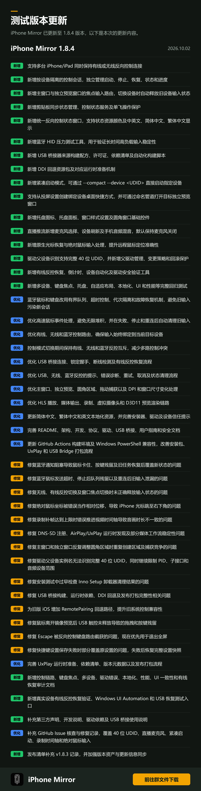

# iPhoneMirror v1.8.5-pre

1.8.5-pre 预发布测试版，汇总自 v1.8.3 以来的更新，包含此前 1.8.4 测试阶段的功能、优化与修复。

本次更新重点带来键盘映射与分步骤配置向导、统一键盘输入路由、五点触控、多设备独立控制、双向文本剪贴板，以及托盘与紧凑启动模式。同时改善有线、无线和蓝牙反向控制的稳定性，完善界面、本地化、驱动工具和运行时组件。

## 新增与改进

### 键盘映射与快捷键

- 新增键盘映射功能，支持点击、固定时长长按、双击、滑动及按住直到松开等操作，每条映射可独立启用、编辑和删除。
- 新增分步骤配置向导，支持按键录入、动作选择、参数设置、投屏取点、滑动录制及确认保存。
- 支持数字、小键盘、方向、导航、功能键及左右修饰键等按键类型，按物理按键位置保存映射。
- 支持在主预览和独立预览中显示映射标记，随画面旋转与缩放自动重新定位。
- 新增统一键盘输入路由，协调快捷键、键盘映射、设备输入及 Windows 输入，减少重复触发和输入冲突。
- 优化快捷键精确匹配、重复映射提示及冲突处理，避免组合键前缀泄漏到设备。
- 优化键盘输入所有权，确保按下、重复和释放始终归属于同一设备与控制会话，防止切换后残留输入进入新设备。

### 五点触控与鼠标输入

- 新增 USB 与无线反向控制五点触控，支持主预览、独立预览及全屏操作，可同时管理最多五个独立触点。
- 优化多触点独立移动、抬起、释放及超限处理，避免不同手指互相影响。
- 新增原生光标恢复与绝对鼠标输入处理，改善远程鼠标定位及分辨率变化后的坐标处理。
- 优化高速鼠标事件合并、发送节奏和队列管理，减少输入积压，并在失败、停止和重连后清理旧输入。

### 多设备与控制会话

- 支持同时保持多台 iPhone/iPad 的有线或无线反向控制连接，按设备独立管理启动、停止、恢复、状态及进度。
- 新增主窗口与独立预览窗口的焦点输入路由，输入随当前预览焦点切换，切换时释放旧设备状态。
- 强化设备身份绑定和控制目标校验，确保触控及键盘输入发送到正确设备。
- 优化多设备并发输入，避免单台设备写入停滞阻塞其他设备，后台会话清理不再影响前台输入。
- 优化控制模式切换期间的互斥处理，避免同一目标的有线、无线与蓝牙控制相互争抢输入。
- 完善蓝牙设备绑定、控制路由及多窗口设备选择，减少目标识别歧义和误发送。

### 双向文本剪贴板

- 新增 Windows 与 iOS 双向文本剪贴板同步，支持复制、粘贴及按设备保存剪贴板状态。
- 完善剪贴板同步状态管理，避免重复操作同时执行。
- 优化并发请求、时序及序列号校验，避免迟到的手机内容覆盖 Windows 上刚复制的新内容。
- 改善剪贴板忙碌、锁屏、服务唤醒及控制模式切换时的等待、重试与取消处理，减少对键鼠输入的影响。
- 完善 Unicode、UTF-16 及超长文本处理，提升中文等复杂文本输入的稳定性。

### 连接、DDI 与恢复

- 新增分阶段反向控制状态窗口，展示设备绑定、连接、DDI、服务、路由、就绪、恢复及失败状态，支持取消和重试。
- 完善状态窗口资源、状态色及中英文、简繁中文显示，优化成功倒计时和完成后自动关闭行为。
- 增强 USB 桥接、锁定握手、断线检测、健康检查及自动恢复，改善有线与无线之间的切换。
- 为旧版 iOS 增加 RemotePairing 回退路径，提高旧系统的配对兼容性。
- 新增 DDI 回退资源包及对应运行时准备机制，完善本地镜像、环境配置覆盖、GitHub 镜像下载、测速、校验、挂载及服务准备流程。
- 强化 DDI 下载与缓存安全，支持完整性校验、原子替换及分阶段错误说明。
- 完善 USB、无线和蓝牙控制的失败诊断、错误代码、重试、取消及状态清理流程。

### 蓝牙输入稳定性

- 优化蓝牙鼠标和键盘的有界队列、发送超时、会话隔离及故障恢复，避免高速输入积压。
- 改善停止、重连及故障后的清理，防止旧任务影响新会话，并及时恢复本机光标状态。
- 新增蓝牙 HID 压力工具，用于验证长时间高负载输入场景下的稳定性。

### 无线投屏与 UxPlay

- 优化无线投屏横竖屏切换、静态画面保留及重绘，减少画面停滞和闪烁。
- 支持窗口缩放、重新显示及新增预览时复用最后一帧，改善静态画面的显示连续性。
- 将 UxPlay 作为独立可选组件提供，支持按需下载安装、进度显示、取消重试及离线准备。
- 完善 UxPlay 版本发现、依赖清单、下载、缓存、校验、安装、回滚及发布打包流程。
- 增强 HLS、AirPlay、DNS-SD、多网卡发现和媒体输出稳定性，改善播放连接及长时间运行时的资源回收。

### 录制、直播与虚拟摄像头

- 直播推流新增麦克风选择、设备刷新及与手机音频混音，麦克风默认关闭。
- 优化录制补帧、音视频时间轴同步及停止后的保存反馈。
- 优化虚拟摄像头启动、停止、帧交换及生命周期管理，避免迟到操作影响新实例。
- 改善 HLS 播放、媒体输出、录制、虚拟摄像头及 D3D11 预览渲染链路。

### 托盘、紧凑启动与界面

- 新增托盘模式、托盘图标、设备面板及独立预览，可在轻量模式下快速控制指定设备。
- 新增 `--compact --device <UDID>` 紧凑启动方式，支持直接启动指定设备，并通过命名管道打开或激活对应独立预览。
- 支持从投屏设置创建绑定设备的桌面快捷方式，完善窗口样式设置及圆角窗口基础控件。
- 优化主窗口、独立预览、托盘、圆角窗口及 DPI/尺寸变化处理，减少捕获竞争和布局跳动。
- 工具栏空间不足时，从右向左自动收起文字并保留图标；空间恢复后自动显示文字，同时保留提示及无障碍名称。
- 完善大字体、小窗口、高对比度和键盘操作支持，改善设置页面、对话框及媒体控件的可访问性。

### 本地化与驱动工具

- 新增独立的繁體中文（台灣）本地化，覆盖应用、驱动工具、安装器、诊断页面及更新说明。
- 完善简体中文、繁体中文和英文资源，支持运行中的窗口动态刷新语言。
- 改善安装器、驱动信任提示及错误处理文案。
- 新增父驱动管理工具，支持设备绑定、驱动变更、设备重建及回滚保护。
- 完善完整 40 位 UDID 识别，同时保留 PID、子接口及目标设备范围限制。
- 强化驱动操作安全验证及失败恢复，避免影响其他 Apple 设备和共享驱动包。

### 性能、构建与发布

- 优化 GPU 帧交接、QuickTime 数据处理、H.264 转换及输入事件处理，降低运行时额外开销。
- 新增 USB 桥接器源码构建配方、许可证、依赖清单及自动化构建脚本。
- 完善 USB Bridge 运行时构建与发布，统一依赖清单、版本元数据及最终程序自检。
- 强化安装器、驱动清理、USB Bridge、DDI、FFmpeg 和 UxPlay 的运行时完整性检查。
- 完善发布包校验，覆盖文件大小、SHA-256、SBOM、更新清单及运行时资产一致性。
- 更新 GitHub Actions 构建环境，改善 Windows PowerShell 兼容性，完善 Windows、.NET、Python、CMake、MSYS2 及 USB 运行时检测。
- 补充 v1.8.3 发布清单记录，加强版本资产与更新信息同步。

## 问题修复

- 修复全屏预览中的 Escape 被反向控制键盘路由截获的问题，优先用于退出全屏。
- 修复快捷键设置保存失败时部分覆盖原设置的问题，失败后恢复完整设置快照。
- 修复绝对鼠标坐标被误当作相对位移，导致 iPhone 光标跳至右下角的问题。
- 修复鼠标移出镜像预览后 USB 触控未释放的问题，按最后有效位置释放触点，避免拖拽和按键残留。
- 修复设备切换、窗口失焦、关闭预览、控制模式切换和重连时未正确释放键盘、鼠标、滚轮及触控状态的问题。
- 修复旧桥接器回调、旧任务及迟到恢复结果覆盖新控制会话状态的问题。
- 修复蓝牙通知阻塞、发送超时及停止后队列残留导致的鼠标卡住、按键残留和重连后输入泄漏问题。
- 修复 UxPlay 自动测试版本生成错误下载地址而出现 404 的问题，完善组件资产校验与失败信息。
- 修复 DNS-SD 注册、AirPlay/UxPlay 运行时发现及部分媒体工作流的稳定性问题。
- 修复录制补帧达到上限时错误推进视频时间轴，导致视频与音频时长不一致的问题。
- 修复录制、媒体播放、虚拟摄像头及网络媒体工作流中的多项资源释放和并发问题。
- 修复主窗口和独立窗口反复调整圆角区域时重复创建区域、拖动捕获相互干扰的问题。
- 修复从托盘首次打开工作区时图标颜色不同步，以及主预览有线、无线触控未正确初始化的问题。
- 修复驱动父设备实例名无法识别完整 40 位 UDID 的问题。
- 修复安装测试中过早检查 Inno Setup 卸载器清理结果的问题。
- 修复 USB 桥接构建、运行时依赖、DDI 回退及发布打包完整性相关问题。

## 测试与文档

- 扩展键盘路由、输入所有权、映射向导、五点触控、多设备、焦点切换及剪贴板自动化测试。
- 扩展 USB 恢复、驱动清理与回滚、运行时完整性及组件下载校验测试。
- 增加托盘、自适应布局、本地化、大字体、高对比度、UI 一致性及性能回归测试。
- 新增真实设备有线反向控制复验、Windows UI Automation 和 USB 恢复测试入口。
- 补充控制链路、键盘焦点、多设备、驱动错误、本地化、性能、UI 一致性及有线恢复审计文档。
- 完善 README、架构、开发、协议、驱动、USB 桥接、用户指南和安全文档。
- 补充 GitHub Issue 核查与修复记录，覆盖 40 位 UDID、直播麦克风、紧凑启动、录制时间轴及绝对鼠标输入。
- 补充第三方声明、开发说明、驱动依赖及 USB 桥接使用说明。

## 测试说明

- 此版本标记为 GitHub Pre-release，供新功能体验和兼容性测试使用。
- 更新内容为自 v1.8.3 以来的累计变更，包含此前 1.8.4 测试阶段的更新。
- 提供 Windows x64 安装版、便携版、UxPlay 可选组件、SBOM 和 SHA-256 校验文件。
- UxPlay 为可选无线组件，可由应用按需下载安装。
- 如遇问题，反馈时请附上应用版本、Windows 与 iOS/iPadOS 版本、设备型号、连接方式、复现步骤及相关日志。

## English Summary

### Added

- Keyboard mapping with a step-by-step configuration wizard, supporting taps, long presses, double taps, swipes, and hold-until-release actions.
- Unified keyboard input routing and five-point touch support for USB and wireless reverse control.
- Independent multi-device control sessions, focus-aware input routing, and bidirectional text clipboard synchronization.
- System tray workflows, compact device startup, and device-specific desktop shortcuts.
- Live-stream microphone selection and mixing with device audio.
- Dedicated Traditional Chinese (Taiwan) localization and an optional, downloadable UxPlay component.
- Parent-device driver management, recovery tools, and expanded automated tests.

### Changed

- Improve device binding, keyboard ownership, input isolation, and transitions between wired, wireless, and Bluetooth control.
- Improve USB recovery, DDI preparation, Bluetooth input queues, and pairing compatibility with older iOS versions.
- Retain static wireless preview frames and improve orientation changes, resizing, and redraw behavior.
- Improve recording synchronization, virtual camera lifecycle management, media output, and network discovery.
- Improve adaptive layouts, accessibility, localization, runtime validation, and release packaging.

### Fixed

- Release stale input after focus changes, device switches, disconnections, and preview closure.
- Make Escape exit full-screen previews before reverse-control keyboard handling.
- Restore the complete shortcut-settings snapshot when saving fails.
- Correct absolute mouse coordinate handling and release USB touch when the pointer leaves the preview.
- Prevent stale callbacks and Bluetooth tasks from affecting newer control sessions.
- Fix invalid UxPlay download URLs generated for automated test builds.
- Fix recording timeline drift, tray-startup input initialization, driver identification, and installer test timing issues.

### Notes

- This is a prerelease for feature and compatibility testing.
- It includes cumulative changes since v1.8.3, including the earlier 1.8.4 testing cycle.
- Windows x64 installer, portable ZIP, optional UxPlay component, SBOM, and SHA-256 checksums are included.
- When reporting an issue, include the app version, Windows and iOS/iPadOS versions, device model, connection type, reproduction steps, and relevant logs.

已发布文件的大小与 SHA-256 清单见[完整更新说明](v1.8.5-pre-complete.zh-CN.md#发布资产)。

## 历史更新截图

以下为 1.8.4 测试版更新页截图，图中更新内容已纳入本次累计更新说明。

